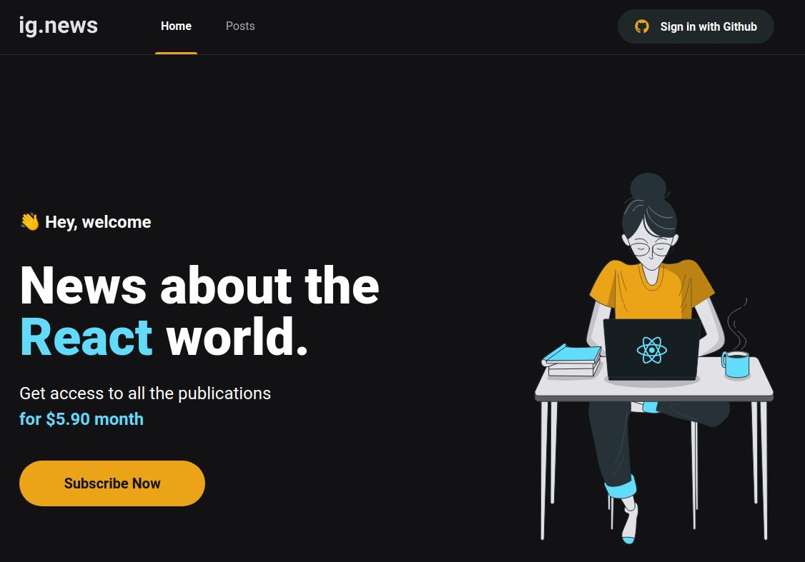

<h1 align="center">
  ig.news
</h1>

<p align="center">
  <a href="#-projeto">Projeto</a>&nbsp;&nbsp;&nbsp;|&nbsp;&nbsp;&nbsp;
  <a href="#-tecnologias">Tecnologias</a>&nbsp;&nbsp;&nbsp;|&nbsp;&nbsp;&nbsp;
  <a href="#-como-executar">Como Executar</a>&nbsp;&nbsp;&nbsp;|&nbsp;&nbsp;&nbsp;
  <a href="#-licença">Licença</a>
</p>

<p align="center">
  
</p>

<p align="center">
  
</p>

## 💻 Projeto

O ig.news é um blog onde os usuários podem se inscreverem para ler posts sobre o mundo do ReactJS.

## ✨ Tecnologias

As tecnologias utilizadas neste projeto foram:

- [Next.js](https://nextjs.org/)
- [React](https://reactjs.org)
- [Sass](https://sass-lang.com/)
- [TypeScript](https://www.typescriptlang.org/)

## 🚀 Como Executar

- Necessário ter instalado o [Node.js](https://nodejs.org/en/) e [Yarn](https://yarnpkg.com/) para executar o projeto.

**Clone o projeto**

```bash
git clone https://github.com/FlavioSant/ignews.git
```

**Instale as dependências:**

```bash
yarn
```

**Executando em modo de desenvolvimento:**

```bash
yarn dev
```

**Executando em modo produção:**

```bash
# Buildar o projeto
yarn build

# Executar em modo produção
yarn start
```

O aplicativo estará rodando em seu navegador em: `http://localhost:3000`

## 📄 Licença

Esse projeto está sob a licença MIT. veja o arquivo [LICENSE](LICENSE) para mais detalhes.

---

By Flávio Santos.

[](https://www.linkedin.com/in/flavio-santos-75487a164/) [](https://www.instagram.com/flavio_santos_/) [](https://www.facebook.com/flavio.santos.9887)
